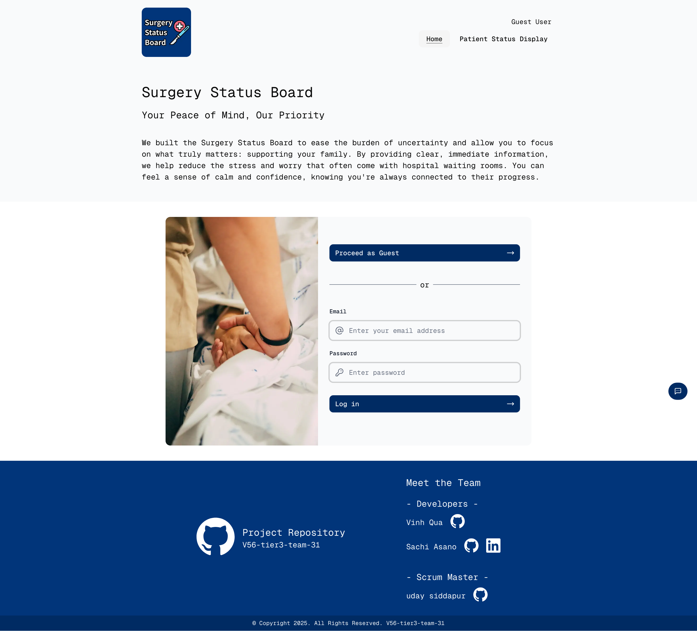
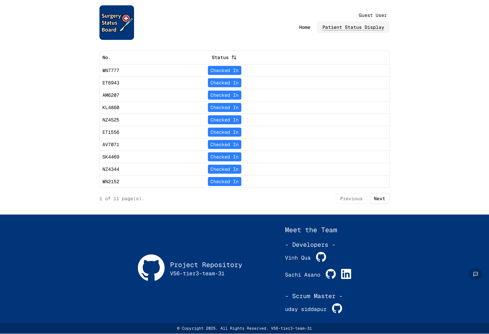
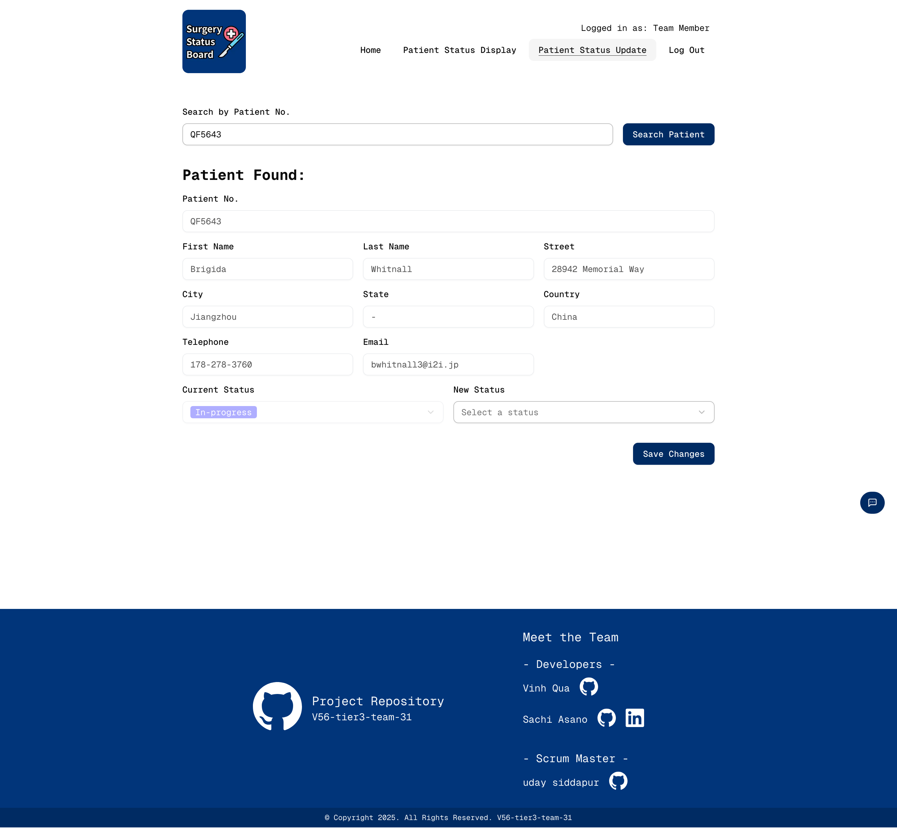
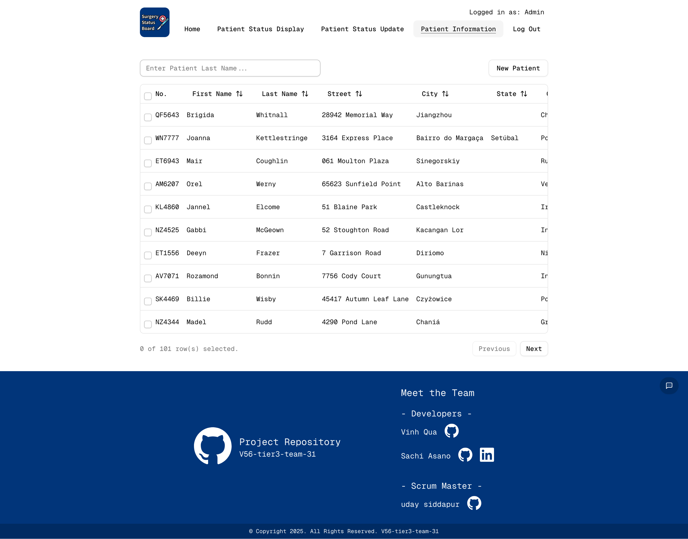
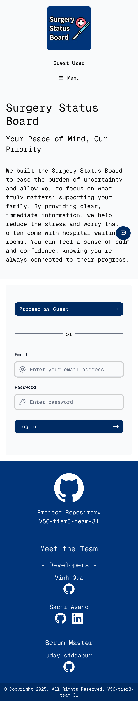
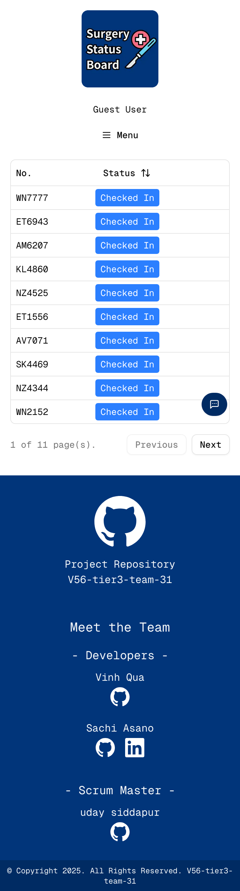
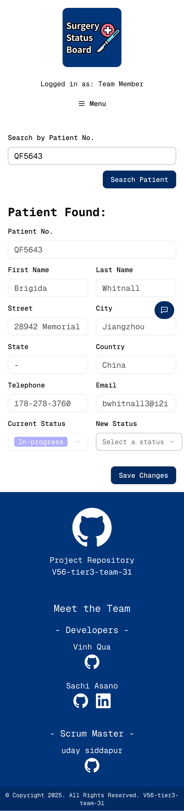
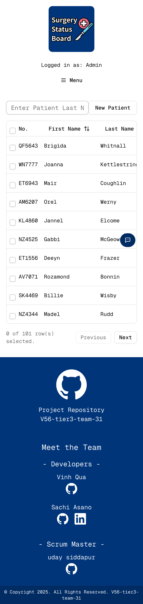

# Surgery Status Board

Developed as a Chingu Voyage Project - Surgery Center Status Board
[Project Requirements](https://github.com/chingu-voyages/voyage-project-surgerystatus)

Surgery Status Board is a web platform for real-time surgical status tracking. 

This helps hospitals keep patients’ families informed and reduces uncertainty in waiting rooms. Guest users can view real-time surgical updates, surgical team members can update patient status throughout the procedure, and admins can register new patients and initiate tracking. Designed to ease emotional stress and improve communication during critical moments.

## Features

1. **Real-time Patient Status Display**

   Allows guest users (e.g., family members) to view the patient's current surgical status in real time.

2. **Surgical Status Updates**

   Enables surgical team members to update the patient's status throughout the procedure.

3. **Patient Information Management**

   Provides admin users with tools to register new patients and initiate status tracking.

## [Live Link](https://youtu.be/lqfvEJ6t8Co?si=B-TMbKbDVQQ1vWFi) 

https://v56-tier3-team-31.vercel.app/

There are three types of users:
1. guest users (NO sign-in required)
2. surgical team member (sign-in required)
3. admin (sign-in required)

### Sign-in Criteria - Admin account

```
email: admin@email.com
password: 123456
```

### Sign-in Criteria - Team Member account

```
email: teammember@email.com
password: 123456
```

## Demo

### Video

### Screenshots (Desktop)

<table>
  <thead>
    <th>Home</th>
    <th>Patient Status Dispay</th>
    <th>Patient Status Update</th>
    <th>Patient Information</th>
  </thead>
  <tr>
    <td valign="top"></td>
    <td valign="top"></td>
    <td valign="top"></td>
    <td valign="top"></td>
  </tr>
</table>

### Screenshots (Mobile)

<table>
  <thead>
    <th>Home</th>
    <th>Patient Status Dispay</th>
    <th>Patient Status Update</th>
    <th>Patient Information</th>
  </thead>
  <tr>
    <td valign="top"></td>
    <td valign="top"></td>
    <td valign="top"></td>
    <td valign="top"></td>
  </tr>
</table>

## Tech Stack

### Frontend

[](https://skillicons.dev)

[Auth.js](https://authjs.dev/), [Zod](https://zod.dev/)

### Backend

[](https://skillicons.dev)

[Google Gemini API](https://ai.google.dev/), [Socket.IO](https://socket.io/)

### Hosting

[](https://skillicons.dev)

### Others

[](https://skillicons.dev)

## Authors

### Developers

- VinhQua: [GitHub](https://github.com/VinhQua) / [LinkedIn](https://linkedin.com/in/liaccountname)
- Sachi Asano: [GitHub](https://github.com/c-est-sa) / [LinkedIn](https://www.linkedin.com/in/sachi-sacha-asano/)

### Scrum Master

- uday siddapur: [GitHub](https://github.com/udaysiddapur) / [LinkedIn](https://linkedin.com/in/liaccountname)
